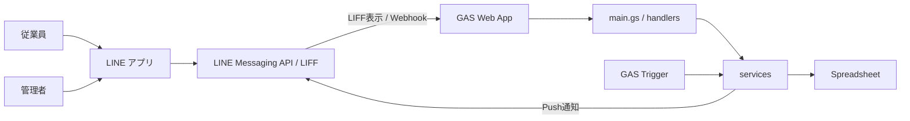
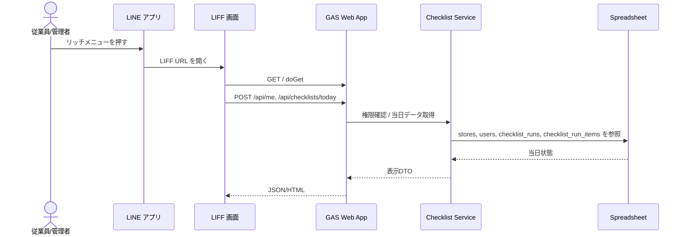
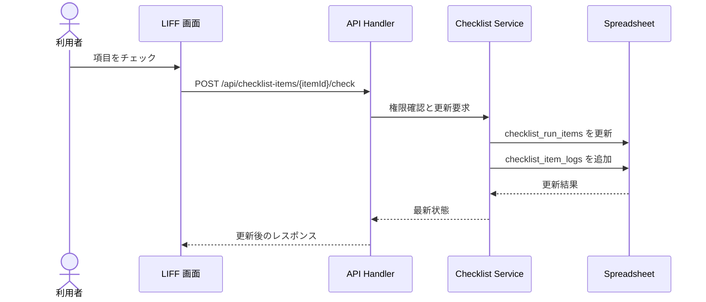
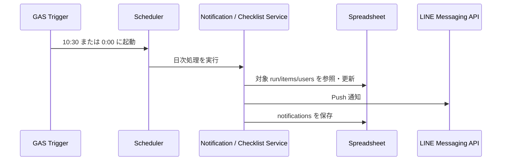

# アーキテクチャ

この文書は、現在の GAS 前提構成に合わせて、会社共有チェックリスト LINE Bot のシステム構成を整理したものです。
責務は「LINE との接点」「GAS の入口」「業務ロジック」「保存先」「定時処理」に分けています。

## 0. 前提

- 初期版は `1ユーザー = 1店舗` 前提で運用し、複数店舗の横断閲覧は扱いません。
- ロールは `part_time / manager / admin` を使い、履歴閲覧は同一店舗の認証済みユーザーに許可します。
- `POST /api/link` は `employeeCode + passcode` のみを受け付け、`lineUserId` は LIFF 認証コンテキストから取得します。
- GAS Web App ではヘッダーが `doPost(e)` に露出しないため、LIFF の `idToken` と Webhook 署名はクエリ経由で入口に渡し、サーバー側検証に回します。

## 0.1 役割と閲覧・操作範囲

| ロール | 業務上の役割 | 閲覧・操作範囲 |
|---|---|---|
| `part_time` | アルバイト | 自店舗の当日チェックリスト閲覧、チェック、自分が付けたチェックの取消 |
| `manager` | 店長・部署責任者 | 自店舗の未完了一覧、履歴閲覧、他人分を含む取消、手動通知、テンプレート管理 |
| `admin` | 本部担当者 | 初期版では単一店舗前提で `manager` と同じ操作範囲を持つ |

## 1. 全体構成図

## 2. リポジトリ上の責務対応

| 層 | 役割 | 現在の配置 |
|---|---|---|
| Web App 入口 | `doGet` / `doPost` とルーティング | [gas/src/main.gs](/home/sota411/Documents/project/ogawaya/gas/src/main.gs) |
| API / Webhook 入口 | LIFF API と LINE Webhook の受け口 | [gas/src/handlers/api.gs](/home/sota411/Documents/project/ogawaya/gas/src/handlers/api.gs), [gas/src/handlers/webhook.gs](/home/sota411/Documents/project/ogawaya/gas/src/handlers/webhook.gs) |
| 業務ロジック | チェックリスト操作、通知判定 | [gas/src/services/checklistService.gs](/home/sota411/Documents/project/ogawaya/gas/src/services/checklistService.gs), [gas/src/services/notificationService.gs](/home/sota411/Documents/project/ogawaya/gas/src/services/notificationService.gs) |
| 定時処理 | 10:30 / 0:00 のジョブ起点 | [gas/src/scheduler/dailyStart.gs](/home/sota411/Documents/project/ogawaya/gas/src/scheduler/dailyStart.gs), [gas/src/scheduler/dailyClosing.gs](/home/sota411/Documents/project/ogawaya/gas/src/scheduler/dailyClosing.gs) |
| 永続化 | Spreadsheet の読み書き | [gas/src/storage/spreadsheetRepository.gs](/home/sota411/Documents/project/ogawaya/gas/src/storage/spreadsheetRepository.gs) |
| LIFF 画面 | 従業員画面 / 管理者画面 | [gas/src/liff/index.html](/home/sota411/Documents/project/ogawaya/gas/src/liff/index.html), [gas/src/liff/user/index.html](/home/sota411/Documents/project/ogawaya/gas/src/liff/user/index.html), [gas/src/liff/admin/index.html](/home/sota411/Documents/project/ogawaya/gas/src/liff/admin/index.html) |

## 3. 主要フロー

### 3.1 LIFF から当日チェックリストを開く

### 3.2 チェック操作

### 3.3 定時処理

- 10:30 に当日分チェックリスト作成と開始通知を行います。
- 0:00 に前日分の未完了通知と締切処理を行います。

## 4. 設計上の境界

- LINE 側の責務
  - リッチメニュー表示
  - LIFF 起動
  - Messaging API による通知送信
- GAS 側の責務
  - `doGet` / `doPost` での入口制御
  - 権限判定
  - チェック操作、履歴保存、通知判定
  - 定時トリガーの実行
  - LIFF `idToken` の verify と LINE Webhook 署名検証
- Spreadsheet 側の責務
  - 店舗、ユーザー、日別チェックリスト、履歴、通知結果の保存

## 5. この構成を採る理由

- 要件上、LINE だけでは状態共有と履歴保存が完結しないため、保存先が必要です。
- MVP では GAS + Spreadsheet に寄せることで、Webhook、LIFF 配信、定時処理を単一基盤に集約できます。
- ただし GAS Web App にはヘッダー参照制約があるため、LINE 由来の署名や ID token は入口で受け渡し方法を明示し、サーバー側 verify を必須にします。
- 将来 DB を外出しする場合も、`handlers -> services -> storage` の責務分割を先に置いておけば差し替えやすくなります。

## 根拠

- [要件定義書.md](/home/sota411/Documents/project/ogawaya/要件定義書.md)
  - チェック状態は Spreadsheet で管理する。
  - Bot が LIFF URL を案内する。
  - ユーザーは所属店舗の当日チェックリストを閲覧する。
  - 10:30 に当日分を作成し、0:00 に前日分を締める。
  - 永続化対象は `checklist_runs`、`checklist_item_logs`、`notifications` である。
