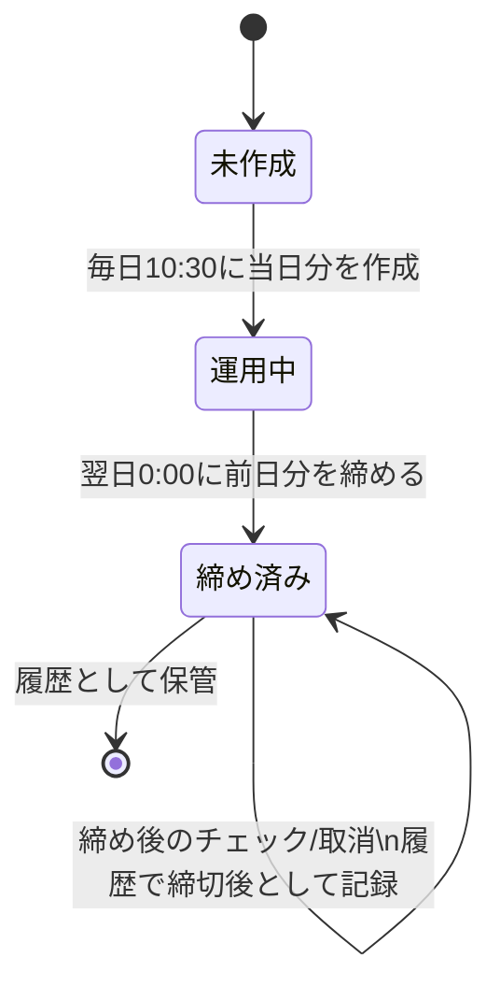
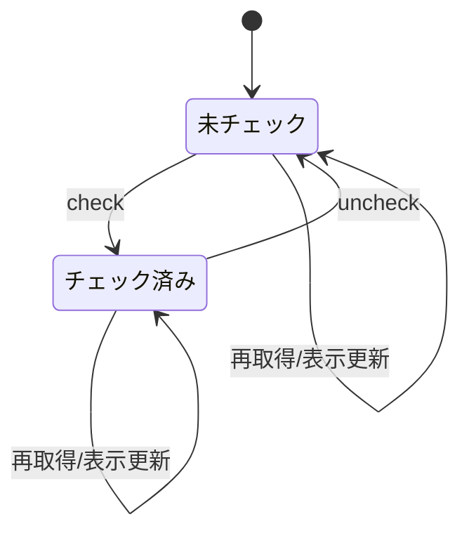
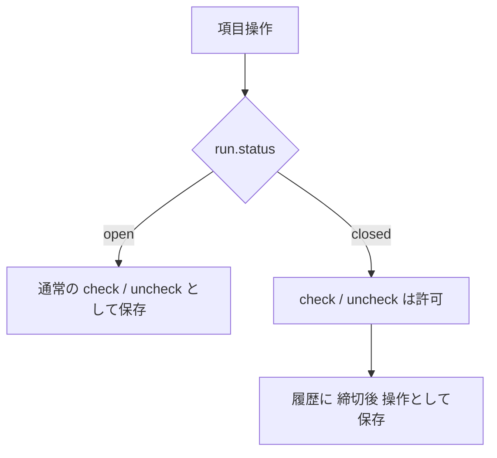

# 状態遷移図

この文書は、会社共有チェックリスト LINE Bot の状態遷移を整理したものです。
要件定義書では `checklist_runs.status = open / closed`、`checklist_run_items.status = unchecked / checked` が定義されています。
一方で、「0:00 以降も前日分のチェックは可能。ただし締切後として履歴に残す」という運用要件もあるため、`状態` と `履歴上の区分` を分けて扱います。
履歴閲覧は同一店舗の認証済みユーザーに許可しますが、状態遷移自体はロールに依存しません。

## 1. 日次チェックリスト単位の状態遷移

### 解釈

- `未作成`
  - 当日分の `checklist_run` がまだ存在しない状態です。
- `運用中`
  - 毎日 `10:30` の定時処理で当日分を作成し、全項目を未チェックで開始します。
- `締め済み`
  - 翌日 `0:00` に前日分を締めた状態です。
  - ただし要件上、締め後もチェック操作自体は禁止しません。
  - 締め後操作は `status` を増やさず、`checklist_item_logs.created_at` と `checklist_runs.closed_at` の比較で締切後として識別します。

## 2. 日別チェック項目単位の状態遷移

### 解釈

- `未チェック`
  - `checklist_run_items.status = unchecked` に対応します。
- `チェック済み`
  - `checklist_run_items.status = checked` に対応します。
- `uncheck`
  - アルバイトは自分のチェックのみ取消可能です。
  - 管理者は全員分の取消が可能です。
- 締切前後の区別
  - 項目の状態は `unchecked / checked` の 2 値のままです。
  - 締切前に付けたチェックか、締切後に付けたチェックかは `checklist_item_logs.created_at` と `checklist_runs.closed_at` の比較で判定します。

## 3. 状態と履歴の分離

この設計にすると、要件定義書の次の 2 条件を両立できます。

- `checklist_runs.status` は `open / closed` のまま維持する
- 締め後も前日分の操作を受け付けつつ、監査上は時刻比較で区別できる

## 根拠

- [要件定義書.md](/home/sota411/Documents/project/ogawaya/要件定義書.md)
  - 10:30 に当日分を作成し、0:00 に前日分を締める。
  - 0:00 以降も前日分のチェックは許可し、締切後操作として識別する。
  - `checklist_runs.status` は `open / closed`、`checklist_run_items.status` は `unchecked / checked` を使う。
  - `checklist_item_logs.action` は `check / uncheck / edit / delete` を使う。
